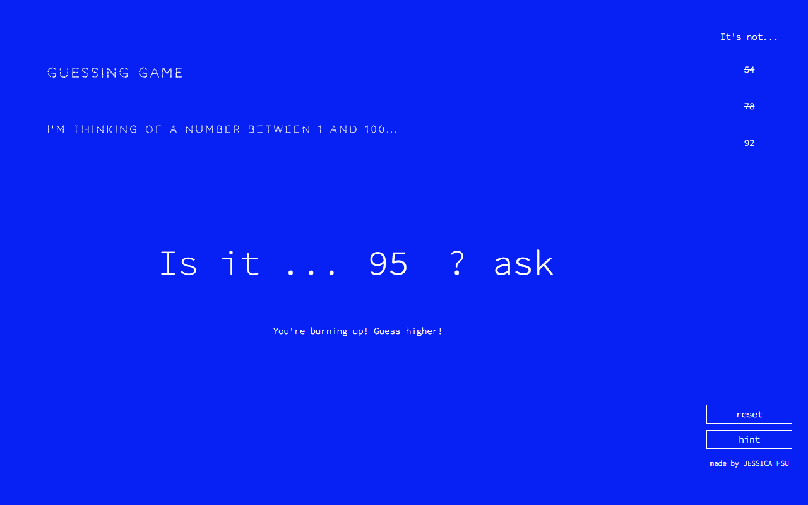

# Guessing Game

## Features
- Player has up to five attempts to guess a randomly-generated number between 1 and 100, inclusive
    - Player is given feedback if they are hot/cold (ice cold, a bit chilly, lukewarm, burning up) and if they should guess higher/lower
    - Player can see their past incorrect guesses
- Reset game / start a new game
- Ask for a hint

## Code
- JavaScript
- JQuery
- HTML
- CSS

## View Demo
View demo [here](https://hsujessica.github.io/guessing-game)

